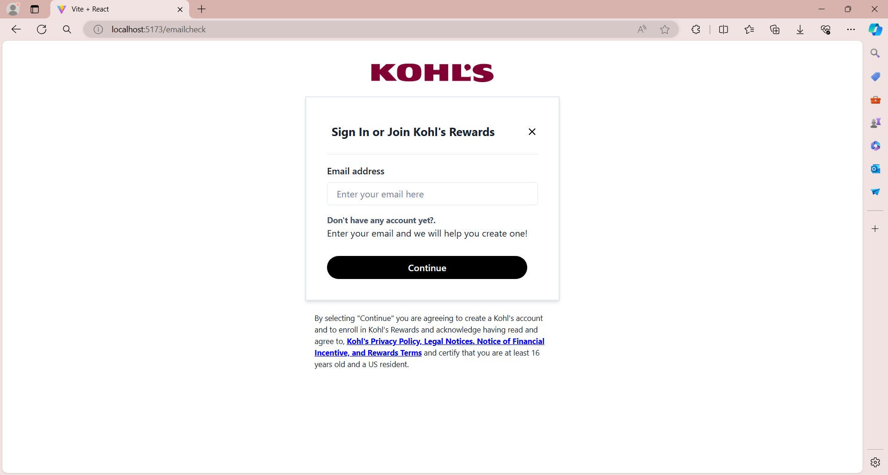
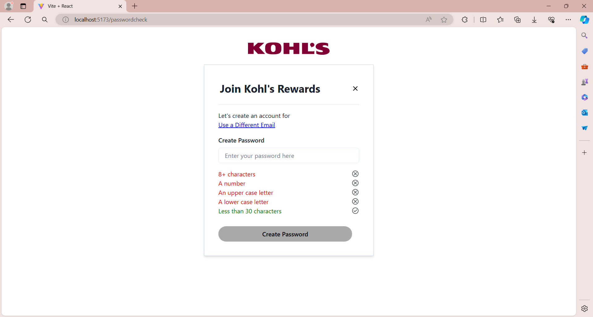
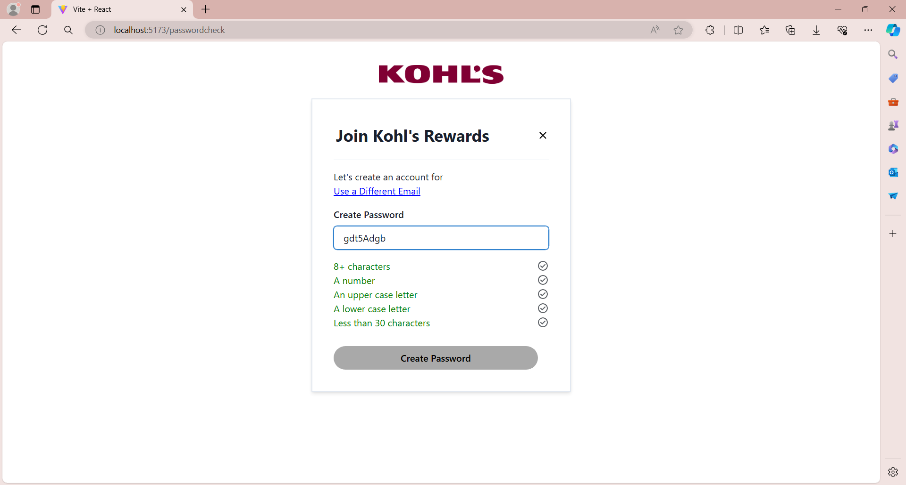

# Kohl's Website Clone

This project is a clone of Kohl's website, built using modern web technologies. The application showcases various functionalities including product browsing, adding items to the cart, user authentication, and more.

## Tech Stack

- **Frontend**: React
- **CSS Framework**: Chakra UI
- **HTTP Client**: Axios
- **State Management and Storage**: LocalStorage
- **Backend**: JSON Server (deployed)

## Features

- **User Authentication**: Sign-in functionality with real-time feedback on password input.
  - Password requirements are enforced and feedback is provided in real time (e.g., red color turns green and cross converts to tick when requirements are met).
- **Routing**: Page navigation is handled using React Router DOM.
  - Different pages for Men, Women, Shoes, Kids, Home Shopping.
  - A detailed product page is accessible via the "View Detail" button.
- **Loading and Error Indicators**: 
  - A loading indicator is displayed while fetching data.
  - Alerts are shown on errors.
- **Cart Functionality**: 
  - Items can be added to the cart from the product detail page.
  - The cart displays different UI states for empty and non-empty states.
  - Items can be deleted from the cart, and the user is navigated back to the home page.
- **JSON Server**: The backend is simulated using JSON Server, which is deployed and accessible.

## How to Run the Project

1. **Clone the repository**:
    ```bash
    git clone https://github.com/your-username/kohls-clone.git
    cd kohls-clone
    ```

2. **Install dependencies**:
    ```bash
    npm install
    ```

3. **Start the JSON Server**:
    ```bash
    json-server --watch db.json --port 5000
    ```

4. **Run the React application**:
    ```bash
    npm start
    ```

## Screenshots

### Homepage


### Product Detail Page


### Cart - Empty State


### Cart - With Items


### Men Page


### Women Page


### Shoes Page


### Kids Page


### Home Shopping Page


### Sign-in Page


### Real-time Password Feedback


### Loading Indicator


### Error Alert


### Navigation


### Product Listing


### Add to Cart


### Cart Summary


### Delete from Cart


### Navigation Back to Home


## Pages

- **Home Page**: Provides an overview but is not the main highlight.
- **Men's Page**
- **Women's Page**
- **Shoes Page**
- **Kids' Page**
- **Home Shopping Page**

Each page features products specific to the category, and users can navigate to detailed product views.

## Deployment

The JSON Server is deployed and the React application can be run locally. Follow the steps in "How to Run the Project" to get started.

## Additional Information

- **LocalStorage** is used for state persistence.
- **Axios** is used for making HTTP requests to the JSON Server.
- **Chakra UI** provides a responsive and accessible UI framework.

## Contributing

Contributions are welcome! Please open an issue or submit a pull request for any improvements or bug fixes.

## License

This project is licensed under the MIT License.
